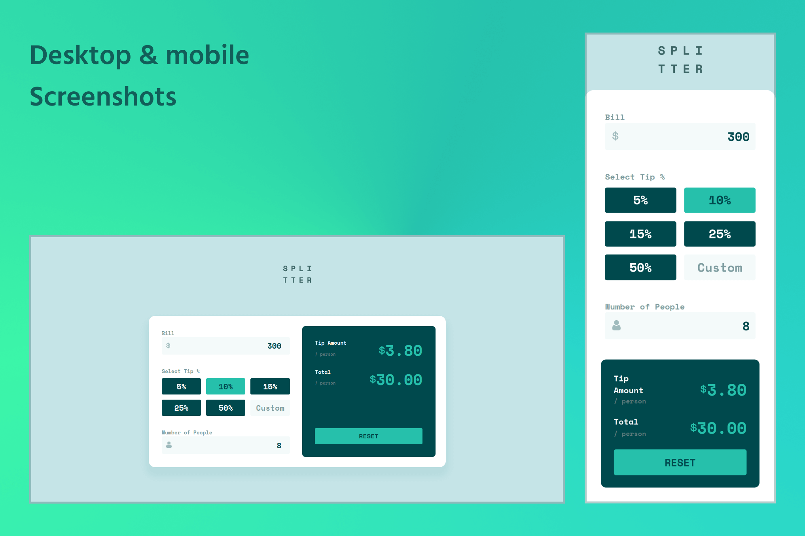

# Frontend Mentor - Tip calculator app solution

This is a solution to the [Tip calculator app challenge on Frontend Mentor](https://www.frontendmentor.io/challenges/tip-calculator-app-ugJNGbJUX). Frontend Mentor challenges help you improve your coding skills by building realistic projects.

## Table of contents

- [Overview](#overview)
  - [The challenge](#the-challenge)
  - [Screenshot](#screenshot)
  - [Links](#links)
- [Built with](#built-with)
- [Local deployment](#local-deployment)
- [Author](#author)

## Overview

### The challenge

Users should be able to:

- View the optimal layout for the app depending on their device's screen size
- See hover states for all interactive elements on the page
- Calculate the correct tip and total cost of the bill per person

### Screenshot



### Links

- Solution URL: [Github page](https://github.com/GootaLK/FM_Tip-calculator-app)
- Live Site URL: [Live on Vercel](https://goota-tip-calculator.vercel.app/)

## Built with

For this challenge I decided not to use frameworks. I just made use of some typescript.
I also used pnpm as package manager, vite as bundler, so nesting and autoprefixer postcss plugins.

- [Vite](https://vitejs.dev/) - Bundler
- [Postcss-nesting](https://github.com/csstools/postcss-plugins/tree/main/plugins/postcss-nesting) - Postcss plugin
- [Autoprefixer](https://github.com/postcss/autoprefixer) - Postcss plugin
- Mobile-first workflow
- Typescript

## Local deployment

To local deploy you need run:

```bash
pnpm build
```

then

```bash
pnpm preview
```

## Author

- Frontend Mentor - [@GootaLK](https://www.frontendmentor.io/profile/GootaLK)

**No social media yet**
